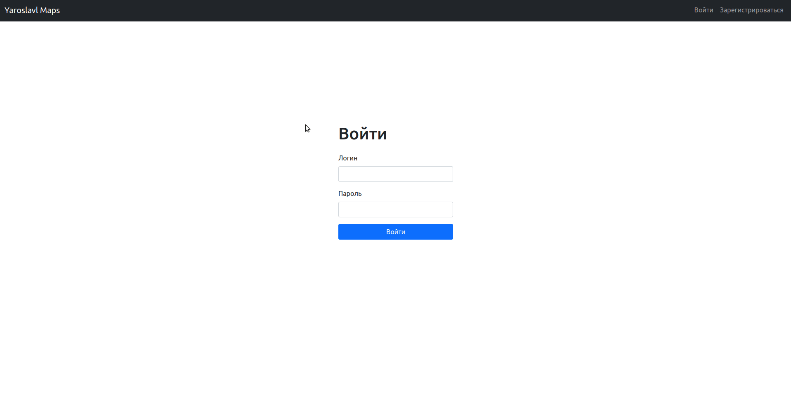

# go-maps

## Description

Web-application for ordering parking places

with qiwi payments + admin page

## Workflow




## Contents
  - [Structure](#structure)
  - [How To Run](#how-to-run)

## Structure

- [cmd/](./cmd/) contains the executable file

- [web/](./web/) contains static files like [js](./web/js/), [css](./web/css/), and [img](./web/img/)

- [pkg/](./pkg) contains [qiwi](./pkg/qiwi/) package used for working with qiwi api

- [handlers/](./handlers/) contains [REST API](./handlers/api/) and [view functions](./handlers/views/) for server side rendering

- [api/](./data/) contains all network request handling functions

    - [auth/](./api/auth/) authentication API

    - [personal/](./api/personal/) API for creating an acccount

    - [orders/](./api/orders/) API for making orders

    - [rates/](./api/rates/) API for setting payment rates

    - [parkings/](./api/parkings/) REST API for creating parking places

    - [views/](./data/sessionstorer/) used for view functions

    - [middlewares/](./data/middlewares/) contains middleware for wrapping APIs to avoid having using js on the client side if possible

- [data/](./data/) contains packages for working with the database like

    - [user/](./data/user/)

    - [order/](./data/order/)

    - [rate/](./data/rate/)

    - [parking/](./data/parking/)

    - [sessionstorer/](./data/sessionstorer/) used for storing user sessions which are used for authentication

## How To Run

1) Create the private key on the qiwi payment website

2) Configure the environment variables in [docker-compose.yml](./docker-compose.yml) if needed

3) Launch the app

```sh
docker-compose up
```

4) Connect to the app using your browser of choice

   with the credentials and app port that were specified in [docker-compose.yml](./docker-compose.yml)
